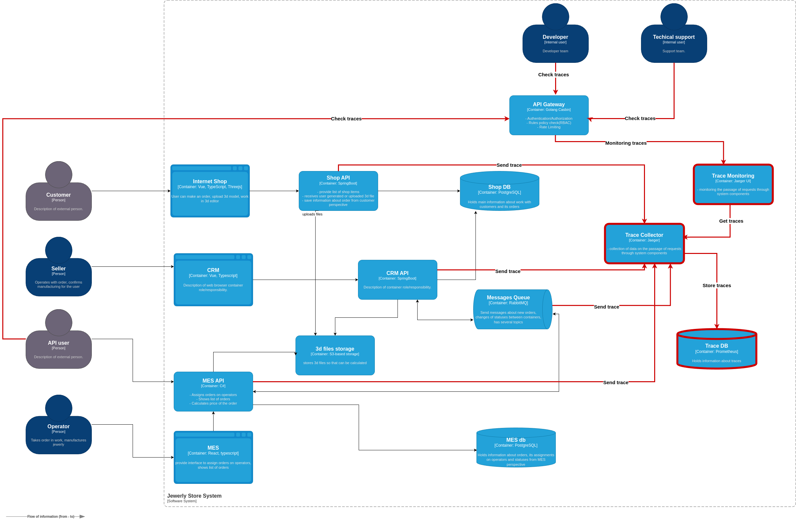

1. **Участки системы для трейсинга, где заказ может сломаться:**
    - **Цепочка спанов для подтверждения заказа:**
    MES API => RabbitMQ => CRM API => Shop DB
    - **Цепочка спанов для выполнения заказа:**
    MES => MES DB => MES API => RabbitMQ => CRM API => Shop DB
    - **Цепочка спанов для расчёта стоимости заказа:**
    3d files storage => CRM API => RabbitMQ => MES API => RabbitMQ => CRM API
    - **Цепочка спанов для загрузки 3D файла заказа через UI магазина:** 
    Internet Shop => Shop API => 3d files storage

   **Список данных, которые должны попадать в трейсинг:**
    - `Trace_ID:` уникальный идентификатор трейсинга, который связывает все спаны в один общий трейс (цепочку запросов).
    - `Span_ID:` уникальный идентификатор каждого конкретного спана (этапа).
    - `Parent_Span_ID:` идентификатор родительского спана, если спан является частью большого запроса.
    - `Span_Name:` краткое описание операции, которую выполняет данный спан.
    - `Timestamp (Время начала и завершения):` время начала и окончания выполнения спана.
    - `Duration:` время выполнения данной операции (разница между временем начала и завершения).
    - `Status:` статус выполнения операции (успешно/ошибка).
    - `Error_Description:` информация об ошибке, если операция завершилась сбоем.
    - `Tags:` дополнительные данные, которые помогают детализировать каждый спан (например, ID заказа, ID пользователя, метод HTTP-запроса, база данных, таблица).

2. **Мотивация:**
    В текущей архитектуре системы у компании возникают проблемы с задержкой/потерей заказов, что негативно сказывается на бизнесе компании - она теряет потенциальную прибыль. Введение трейсинга позволит:
    - **Идентифицировать узкие места в системе** — трейсинг покажет, где заказы "зависают" и на каких этапах происходят сбои.
    - **Обеспечить прозрачность работы системы** — трейсинг позволяет отслеживать полный путь заказа через все системы, от создания до завершения.
    - **Сократить время на диагностику и исправление ошибок** — трейсинг помогает быстрее находить причины проблем, что сокращает время доставки новых фичей и уменьшает количество недовольных клиентов.
    - **Оптимизировать производительность** — трейсинг помогает выявить медленные операции, позволяя улучшить общую производительность системы.

   **Бизнес метрики, на которые повлияет трейсинг:**
    - **Среднее время выполнения заказа:** трейсинг позволит сократить это время за счёт выявления задержек.
    - **Процент успешных заказов:** трейсинг поможет уменьшить количество потерянных или задержанных заказов.
    - **Доверие клиентов:** снижение количества сбоев и уменьшение времени задержек напрямую повлияют на удовлетворенность клиентов.

   **Технические метрики, на которые повлияет трейсинг:**
    - **Время диагностики ошибок:** сократится время, необходимое для поиска и устранения проблем.
    - **Нагрузка на систему:** трейсинг поможет понять, какие части системы перегружены, что позволит лучше балансировать нагрузку.

3. **Предлагаемое решение:**
    - Трейсинг будет реализован с помощью sdk OpenTelemetry для сбора данных о прохождении запросов через все компоненты системы и Jaeger для визуализации и агрегирования этих данных. Sdk OpenTelemetry будет интегрирован во все основные сервисы: Shop API, CRM API, MES API и очередь сообщений RabbitMQ. Каждый запрос будет сопровождаться  `Trace_ID` и `Span_ID`, которые передаются между сервисами через HTTP-заголовки или сообщения в RabbitMQ. Это позволит отслеживать полный путь каждого заказа.

   **Компоненты для внедрения и доработки:**
    - **Shop API, CRM API, MES API:** внедрение OpenTelemetry для генерации и передачи трейсинговых данных.
    - **RabbitMQ:** настройка трейсинга для сообщений между CRM и MES.
    - **Jaeger:** сбор и визуализация трейсов.
    - **Prometheus и Grafana:** для метрик и дашбордов.

    

4. **Компромиссы:**
    Трейсинг не всегда является решением всех проблем, и его внедрение может нести определённые сложности:
    - **Высокая стоимость внедрения** — добавление трейсинга во все сервисы требует времени и усилий команды, особенно в системах, где доработка исходного кода может быть затруднена.
    - **Нагрузка на систему** — сбор трейсинговых данных создаёт дополнительную нагрузку на сервисы и сеть, что может потребовать дополнительной оптимизации и масштабирования.
    - **Необходимость изменения существующих систем** — если сервисы, такие как MES или CRM API, используют устаревшие или проприетарные решения, интеграция трейсинга может быть сложной и/или дорогостоящей.
    - **Ограниченная польза для систем с минимальными задержками** — трейсинг может не принести ощутимых результатов в системах, где задержки минимальны или где ошибки легко диагностировать другими способами.

5. **Аспекты безопасности:**
    - **Внутри компании:**
        - **Аутентификация и авторизация** — вход в систему возможен только для сотрудников с актуальной учётной записью и ролевыми правами. Полный доступ только для команды поддержки, ограниченный доступ для разработчиков и менеджеров.
        - **Шифрование данных:** передача данных трейсинга внутри компании осуществляется с использованием TLS/SSL.
        - **Ограничение сбора конфиденциальных данных:** данные, содержащие конфиденциальную информацию (например, персональные данные пользователей), не должны логироваться. Все метаданные должны быть предварительно фильтрованы.
        - **Сегментация доступа:** система трейсинга будет изолирована в корпоративной сети. Доступ к системе возможен только через защищённые внутренние сети или VPN.
        - **Мониторинг и аудит:** логирование всех действий сотрудников в системе трейсинга для выявления аномальной активности.

    - **Внешние меры для партнёров (приём заказов через API):**
        - **Аутентификация через OAuth 2.0:** партнёры будут аутентифицироваться через OAuth 2.0, получая токены доступа с ограниченными правами.
        - **Ограничение доступа по ролям и данным:** доступ к трейсингу данным будет ограничен только трейсами, связанными с их запросами или транзакциями. Данные других партнёров или внутренние данные компании будут недоступны.
        - **Шифрование данных при передаче:** все данные, передаваемые через API от партнёров и к ним, будут зашифрованы с использованием TLS/SSL для защиты от перехвата в публичных сетях.
        - **API Gateway и Rate Limiting:** для управления доступом к системе трейсинга со стороны партнёров будет использоваться API Gateway.

        