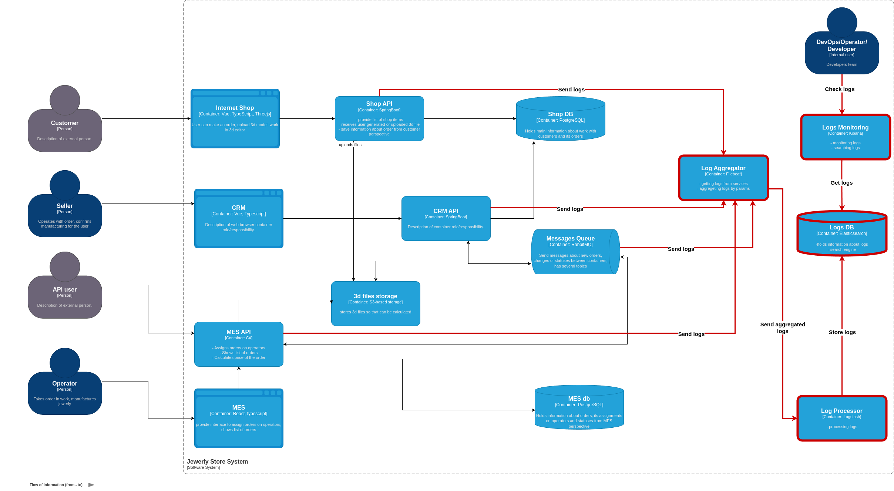

## 1. **Список необходимых логов с уровнем INFO**
- **Shop API:**
    - **INFO:** Логирование создания заказа — время создания заказа, идентификатор покупателя, номер заказа, статус заказа.
    - **INFO:** Логирование самого запроса — URL и метод(GET, POST и тд), код ответа(200, 500 и тд), время запроса, длительность запроса. 
    - **ERROR:** Ошибки при создании заказа или загрузке файлов.
- **CRM API:**
    - **INFO:** Логирование изменений статусов заказов — время изменения статуса, номер заказа, старый и новый статусы.
    - **INFO:** Логирование отправки/получения данных в RabbitMQ — время отправки/получения сообщения, номер заказа, идентификатор сообщения.
    - **ERROR:** Ошибки передачи данных в RabbitMQ.
- **MES API:**
    - **INFO:** Логирование расчёта стоимости заказа — время начала и завершения расчёта, номер заказа, итоговая стоимость, статус.
    - **INFO:** Логирование отправки/получения данных в RabbitMQ — время отправки/получения сообщения, номер заказа, идентификатор сообщения.
    - **INFO:** Логирование изменения статусов заказов — время изменения статуса, номер заказа, старый и новый статусы.
    - **ERROR:** Ошибки расчёта стоимости или изменения статусов.
- **RabbitMQ:**
    - **INFO:** Логирование передачи сообщений между CRM и MES — время передачи сообщения, идентификатор сообщения, статус (успех или ошибка).
    - **ERROR:** Ошибки при обработке или передаче сообщений.
- **3D-file-storage:**
    - **INFO:** Время начала и окончания обработки, длительность обработки.
    - **INFO:** Идентификатор файла.
    - **INFO:** Результат обработки (успешно/ошибка).   
- **База данных (PostgreSQL):**
    - **INFO:** Логирование выполнения запросов — время выполнения запроса, тип запроса (SELECT/INSERT/UPDATE), номер заказа, время выполнения, статус (успех/ошибка).
    - **ERROR:** Логирование ошибок при доступе к базе данных (например, таймауты, сбои соединений).

## 2. **Мотивация**
Логирование необходимо для обеспечения стабильной работы системы, мониторинга её состояния и быстрого реагирования на проблемы.
Логирование помогает:
- **Улучшить диагностику и устранение проблем:** наличие логов упрощает поиск источников ошибок и снижает время их устранения.
- **Повысить прозрачность процессов:** системные логи позволяют следить за состоянием заказов и других ключевых операций.
- **Сократить время простоя:** при наличии логов можно быстрее реагировать на сбои и уменьшить время простоя системы.

**Бизнес-метрики, на которые влияет логирование:**
- **Процент успешных заказов:** снижение числа ошибок и потерей при обработке заказов за счёт быстрого реагирования.
- **Удовлетворённость клиентов:** логирование помогает быстрее решать проблемы и улучшать клиентский опыт.

**Технические метрики, на которые влияет логирование:**
- **Среднее время реакции на инциденты:** с логами проще и быстрее находить проблемы.
- **Время выполнения ключевых операций:** с помощью логов можно анализировать и улучшать производительность системы.
- **Процент ошибок при передаче сообщений:** позволяет быстро обнаруживать сбои в очередях RabbitMQ.

**Приоритет систем для логирования и трейсинга:**
- **Shop API и CRM API:** приоритетное логирование и трейсинг, так как они напрямую связаны с заказами и взаимодействием с клиентами.
- **MES API:** важен для расчётов стоимости и обработки заказов, также должен быть покрыт трейсингом и логированием.

## 3. **Предлагаемое решение**
- **Технологии для реализации логирования:**  
  Elasticsearch для хранения и поиска логов, Logstash для обработки и маршрутизации логов из различных сервисов, Kibana для визуализации логов и создания дашбордов (ELK stack). Filebeat: для сбора и передачи логов в конвеер данных Logstash.

- **Политика безопасности логов:**  
  - **Чувствительные данные:** Логи не должны содержать персональные данные клиентов (например, информацию о платежах). Любая чувствительная информация (например, номера телефонов или адреса) должна быть замаскирована или исключена из логов.  
  - **Доступ к логам:** Только определённые роли (администраторы, разработчики, операторы) должны иметь доступ к полным логам через Kibana или Elasticsearch.

- **Мониторинг и аудит доступа:**
  - Логируются все попытки доступа к системе логов (включая успешные и неуспешные).
  - Регулярный аудит доступа к логам, с уведомлениями о подозрительных действиях (например, массовая выгрузка логов).

- **Политика хранения логов:**  
  - Логи будут храниться в отдельном индексе для каждой подсистемы (Shop API, CRM API, MES API).  
  - Логи будут храниться в течение 30 дней, после чего будут автоматически удаляться или архивироваться в зависимости от важности.  
  - Максимальный размер логов для каждого индекса будет регулироваться на основе производительности и объёма системы.

  

## 4. **Превращение системы сбора логов в систему анализа логов:**
**Необходимые мероприятия:**
- **Алертинг на основе логов:**  
  Настройка алертов в Kibana для обнаружения аномалий, таких как резкий всплеск ошибок,неожиданное увеличение количества запросов,таймауты в ключевых API-запросах. Алерты будут отправляться в Telegram или систему управления инцидентами для своевременной реакции.
- **Поиск аномалий:**  
  Настройка мониторинга аномалий в логах (например, всплеск числа заказов или ошибок) с использованием функциональности Kibana.
  Как вариант использовать ИИ-ассистент.
  
- **Потенциальные сценарии аномалий:**
 - **DDoS-атака:** 10 000+ запросов в секунду к API или сервису заказов. Реакция: временно блокировать IP через WAF, уведомить команду безопасности.
 - **Рост ошибок:** Резкое увеличение 500 Internal Server Error из одного компонента. Реакция: выделить инженера для диагностики.
 - **Низкая активность:** Внезапное отсутствие заказов в пиковое время. Реакция: проверить API-магазина и интернет-соединение.

## 5. **Критерии для выбора технологии для работы с логами:**
- **Масштабируемость:**  
  Технология должна поддерживать сбор логов с множества компонентов и масштабироваться при росте нагрузки. Elasticsearch хорошо справляется с большими объёмами данных.
- **Поиск и фильтрация:**  
  Возможность эффективно искать и фильтровать логи по ключевым меткам (например, по идентификатору заказа). Kibana предоставляет удобный интерфейс для поиска и фильтрации.
- **Визуализация:**  
  Технология должна поддерживать создание дашбордов и визуализацию данных. Kibana идеально подходит для этого.
- **Безопасность:**  
  Логирование должно включать меры безопасности для защиты данных. Elasticsearch поддерживает настройку доступа по ролям и шифрование логов.
- **Производительность и отказоустойчивость:**  
  Технология должна быть отказоустойчивой и обеспечивать стабильную работу при высоких нагрузках. ELK stack отвечает этим требованиям.