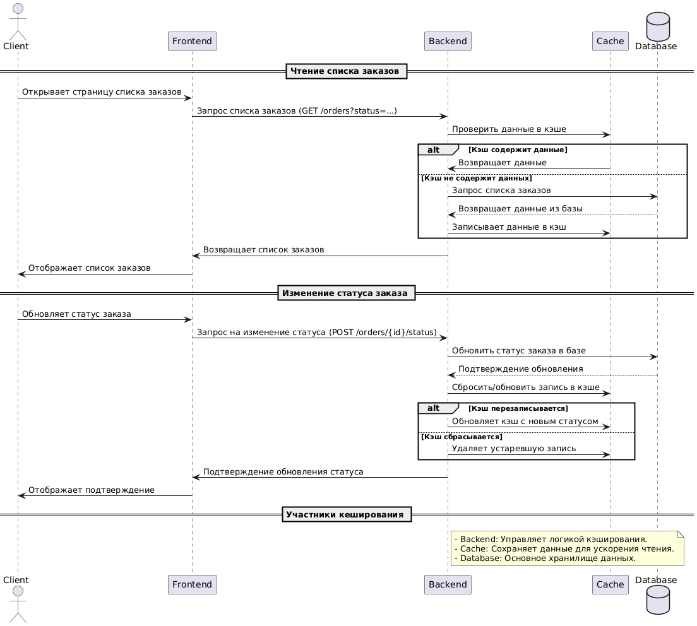

## 1. Какие части системы имеет смысл закешировать?

На основе анализа системы компании "Александрит" и C4-диаграммы, мы можем выделить несколько частей системы, где кеширование даст наибольшую выгоду:
- **Чтение списка заказов:** операция, которая часто выполняется как клиентами (через Shop API), так и операторами (через CRM и MES API). Поскольку список заказов обновляется не каждую секунду, кеширование позволит снизить нагрузку на базу данных и ускорить время отклика для пользователей.
- **Расчёт стоимости заказа (MES API):** операция сложная и ресурсоёмкая, особенно если клиент загружает детализированную 3D-модель для расчёта. Кеширование результатов расчётов для повторяющихся заказов (или похожих моделей) может существенно снизить нагрузку на систему.

## 2. Мотивация

В текущей архитектуре одним из узких мест яляется работа с Shop API, MES API и CRM API, а именно: чтение списка заказов и расчет стоимости заказов.
### Проблемы, которые решает кеширование:

- **Высокая нагрузка на базу данных:**  
  Система "Александрит" активно растёт, количество заказов увеличивается каждый месяц. Запросы к базе данных по чтению списка заказов и их статусов увеличивают нагрузку, что может привести к замедлению работы и снижению производительности.

- **Медленное время отклика на операции, которые не требуют моментальных обновлений:**  
  Операции, такие как чтение статусов заказов или расчёт стоимости, выполняются часто, но данные на этих этапах могут редко меняться. Кеширование этих операций ускорит работу системы для клиентов и операторов.

- **Масштабируемость:** 
Уменьшение нагрузки на БД. При росте кол-ва заказов, мы защитим нашу базу данных от избыточных запросов, которые могут привести к замедлению и сбоям в системе.  

### Какие элементы системы включить в кеширование:

- **Чтение списка заказов (Shop API, CRM API, MES API):**  
  Кеширование позволит уменьшить количество обращений к базе данных и ускорить обработку запросов, связанных с просмотром заказов.

- **Расчёт стоимости заказа (MES API):**  
  Кеширование результатов расчёта для одинаковых или похожих заказов сократит время на повторные вычисления и уменьшит нагрузку на ресурсы.

## 3. Предлагаемое решение

В данном случае выбираем серверное кэширование т.к.
1. Клиенское кэширование хорошо работает для статичных ответов, у нас же меняеющийся по статусам заказ, из-за этого у нас есть риск увидеть устаревшую информацию
2. Делает систему более предсказуемой, операторы будут в равных условиях, т.к. для всех время кэша и его логика одинаковы
3. Мы представляем внешнее публичное API. И никто не гарантирует его правильное использование с правильными загаловками кэширования.

### Выбор паттерна

| **Паттерн**      | **Плюсы**                                                 | **Минусы**                                                             |
|------------------|-----------------------------------------------------------|------------------------------------------------------------------------|
| **Cache-Aside**   | - Простая реализация.  - Кэш заполняется только востребованными данными.  - Позволяет гибко управлять TTL. | - Первая загрузка может быть медленной (кэш нужно «прогреть»).  - Актуальность зависит от TTL или ручного сброса. |
| **Write-Through** | - Кэш всегда содержит актуальные данные.  - Удобен для часто обновляемых данных. | - Увеличивает время записи, так как данные пишутся и в базу, и в кэш.  - Сложнее реализовать. |
| **Refresh-Ahead** | - Актуальные данные доступны заранее.  - Подходит для прогнозируемых запросов (e.g., популярные страницы). | - Может кэшировать ненужные данные.  - Требует грамотной настройки для предотвращения избыточной нагрузки. |
| **Read-Through**  | - Прозрачный для приложения: кэш сам обращается к базе.  - Простота использования для популярных фреймворков. | - Может стать «узким местом», если нагрузка на кэш-сервер возрастает. |

**Итоговый выбор: Cache-Aside**

**Почему:**
- **Гибкость**: Паттерн позволяет кэшировать только нужные данные (например, текущие заказы по статусам).  
- **Простота реализации**: Подходит для большинства сценариев MES, где кэш обновляется по мере запросов операторов.  
- **Оптимизация ресурсов**: Нет необходимости кэшировать ненужные данные, что снижает избыточное использование памяти.

**Как будет работать:**
1. При запросе заказов проверяется кэш:
   - Если данные есть, они возвращаются из кэша.  
   - Если данных нет, они запрашиваются из базы, затем записываются в кэш.  
2. Обновление кэша происходит вручную:
   - Например, сброс данных при изменении статусов заказов в базе или по истечении TTL.

### Стратегия инвалидации кеша

Для кеширования в системе "Александрит" мы выберем стратегию инвалидации по ключу и временную инвалидацию (TTL):

**Инвалидация по ключу:**
    - При изменении статуса заказа или обновлении списка заказов, кеш для этих данных немедленно инвалидируется.
    - Это позволяет поддерживать актуальные данные в кеше и не отдавать клиентам устаревшую информацию.

**Временная инвалидация (TTL):**
    - Для часто запрашиваемых данных (например, список заказов или статусы) установим TTL (Time-To-Live) кеша на 5-10 минут.
    - Это позволит обновлять данные через регулярные промежутки времени, даже если изменения в системе происходят редко.

---

### Почему другие стратегии не подходят:
- **Программная инвалидация:** сложна в реализации, так как потребует отслеживания всех операций, которые могут влиять на данные в кеше.
- **Полная инвалидация:** неэффективна, так как приведёт к частой очистке кеша, что лишает систему преимуществ кеширования.

## Диаграмма последовательности действий (Sequence diagram)

